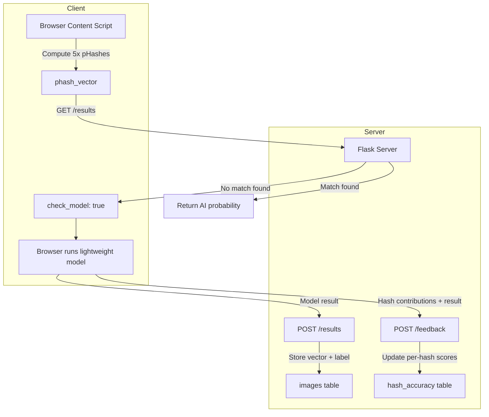

```mermaid
flowchart TD
    A[Browser Content Script] -->|Compute 5x pHashes| B
    B[phash_vector] -->|GET /results| C[Flask Server]

    C -->|Match found| D[Return AI probability]
    C -->|No match found| E[check_model: true]

    E --> F[Browser runs lightweight model]
    F -->|Model result| G[POST /results]
    F -->|Hash contributions + result| H[POST /feedback]

    G -->|Store vector + label| I[images table]
    H -->|Update per-hash scores| J[hash_accuracy table]

    

    subgraph Server
        C
        G
        H
        I
        J
    end

    subgraph Client
        A
        B
        E
        F
    end
```